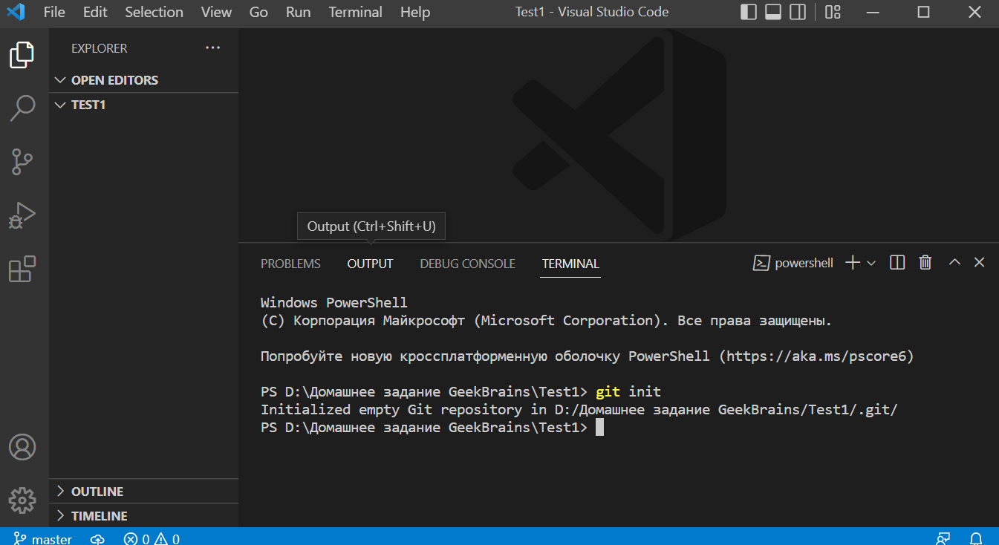
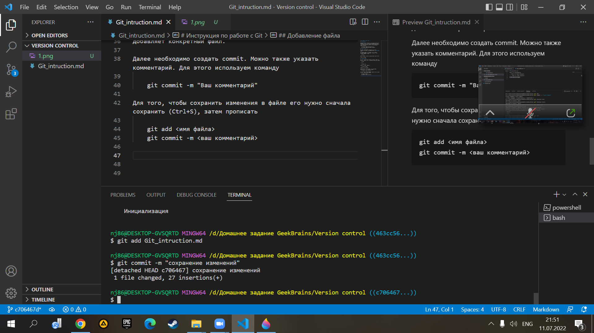

# Инструкция по работе с Git

## Установка Git

Необходимо пройти по официальной ссылке https://git-scm.com/downloads и скачать версию для вашей операционной системы. После установки программы необходимо ввести имя пользователя и адрес электронной почты. Для этого в git прописываем следующие команды:

    git config --global user.name <ваше имя>
    git  config --global user.email <ваш email>

## Создание репозитория

Для работы с Git необходимо использовать программу с графическим интерфейсом. Для Windows подойдет **Visual Studio Code**.

Для создания репозитория нужно открыть в Visual необходимую папку, которую мы будем отслеживать, вызвать терминал и прописать команду 

    git init

Теперь Git будет отслеживать изменения файлов вашего проекта

*Например*

## Добавление файла 

Для того, чтобы Git начал отслеживать изменения в файле, его необходимо добавить. Для этого необходимо использовать команду

    git add

При этом 

    git add --all

добавляет все файлы в папке, а

    git add <имя файла>

добавляет конкретный файл.

Далее необходимо создать commit. Можно также указать комментарий. Для этого используем команду

    git commit -m "Ваш комментарий"

Для того, чтобы сохранить изменения в файле его нужно сначала сохранить (Ctrl+S), затем прописать 

    git add <имя файла>
    git commit -m <ваш комментарий>

*Например*

## Сравнение commit-ов.

Для того, чтобы сравнить текущую версию файла с последним commit-ом, используется команда

    git diff

Для того, чтобы вывести все commit-ы, используется команда

    git log

Для перехода между commit-ами используется комманда

    git checkout <номер коммита>

> Номер коммита можно посмотреть через git log.

## Работа с ветками

Git позволяет работать с файлами, создавая ветки. Для работы с ветками используются следующие команды:

* git branch - показывает все имеющиеся ветки
* git branch <название ветки> - создает новую ветку
* git checkout <название ветки> - переход на нужную ветку
* git branch -d <название ветки> - удаляет ветку
* git merge <название ветки> - объединяет текущую ветку с необходимой
* git log --graph - выводит графически ветки с commit-ами на экран
